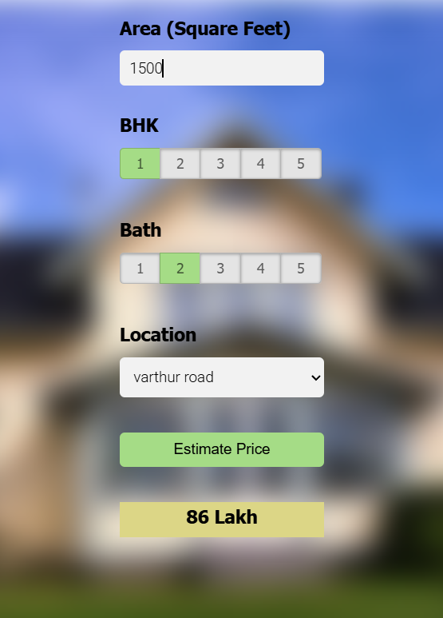
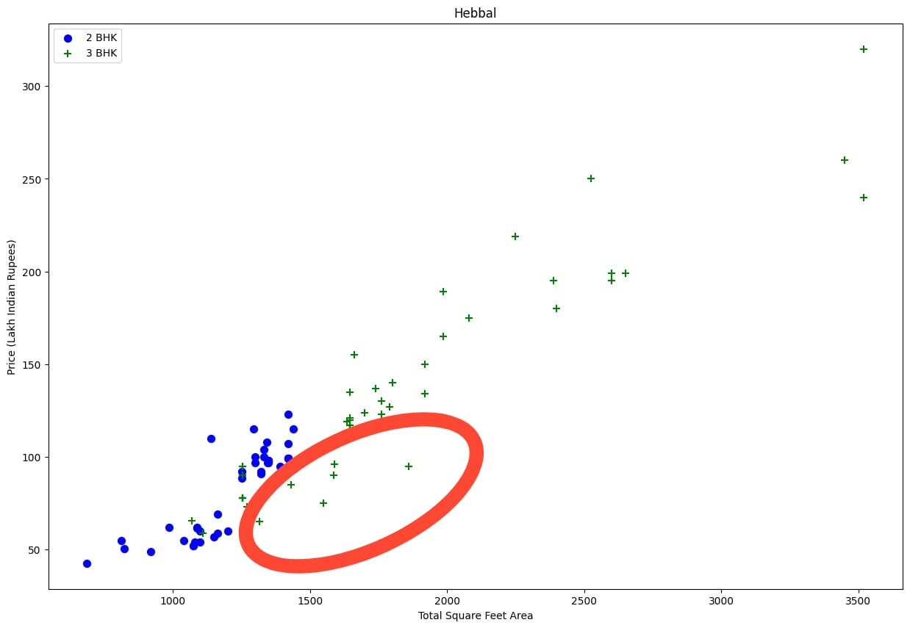
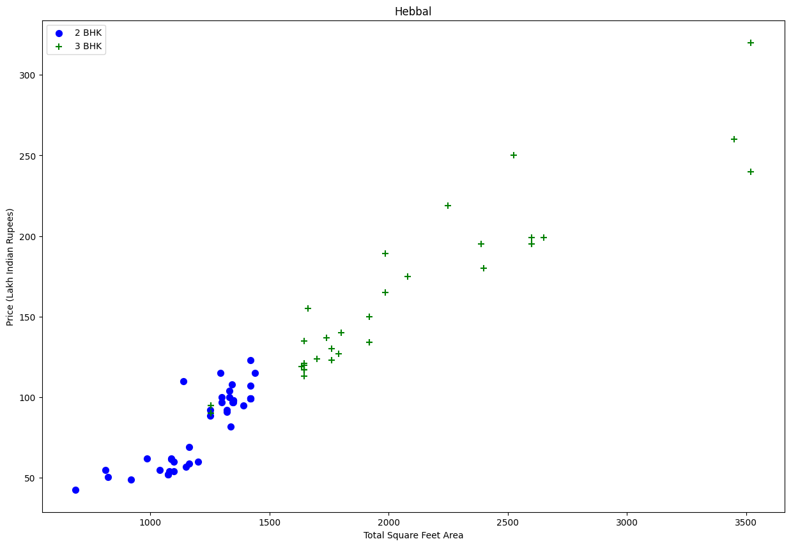

# Bangalore House Price Prediction 🏡💰

**Machine Learning Project** | Python • Scikit-learn • Real Estate Domain

Bangalore House Price Prediction ML project. Features: data cleaning, feature engineering, outlier removal (business logic + statistical), visualizations, multiple models (Linear, Lasso, Decision Tree, Random Forest, Gradient Boosting) tuned via GridSearch + ShuffleSplit CV, and a live prediction web app using HTML, CSS & JS.

    

## 🚀 Live Demo
*(Render URL – https://bangalore-home-price-prediction-ae1a.onrender.com/)*  


## 📊 Dataset
- **Source**: [Kaggle - Bengaluru House Price Data](https://www.kaggle.com/datasets/amitabhajoy/bengaluru-house-price-data)  
- **Size**: ~13K records with features like location, total_sqft, bath, bhk, price.

## 🔍 What I Did:

### 1. **Data Cleaning & Preprocessing**
- Handled missing values.
- Fixed inconsistent data (e.g., sqft range parsing like "1133 - 1384").
- Converted various area units (sqft, sq. meter, acres, cents, gaj, etc.) to standardized square feet

### 2. **Feature Engineering**
- Extracted and cleaned the BHK (Bedroom-Hall-Kitchen) feature from the raw "size" column (e.g., "2 BHK", "4 Bedroom" → integer BHK count)
- Created `price_per_sqft` for better modeling and outlier detection.

### 3. **Outlier Detection & Removal** (Smart Business + Statistical)
- Removed illogical entries (e.g., bathrooms > BHK + 2, total_sqft < 300)
- Removed higher-BHK homes cheaper per sqft than smaller BHK in same location (location-wise mean comparison)
- Applied statistical filters: Z-score (>3σ) on price_per_sqft

**Hebbal Location – Price per sqft distribution (Before vs After outlier removal)**

| Before Outlier Removal                         | After Outlier Removal                   |
|------------------------------------------------|-----------------------------------------|
|  |  |


### 4. **Dimensionality Reduction**
- Locations with <10 data points grouped as "Other" before one-hot encoding

### 5. **Model Training & Evaluation**
- Trained 5 regression models using Scikit-learn.
- **Cross-Validation**: ShuffleSplit (3 folds, 20% test).
- **Hyperparameter Tuning**: GridSearchCV for optimal params.
- Metrics: R², RMSE, MAE (focus on R² for variance explained).

#### GridSearchCV Results
| Model              | Best R² Score | Best Parameters                              |
|--------------------|---------------|----------------------------------------------|
| Linear Regression  | **0.86**      | {} (baseline)                                |
| Lasso              | 0.81          | {'alpha': 0.1}                               |
| Decision Tree      | 0.80          | {'max_depth': 10, 'min_samples_split': 2}    |
| Random Forest      | 0.84          | {'max_depth': None, 'n_estimators': 100}     |
| Gradient Boosting  | 0.85          | {'learning_rate': 0.1, 'n_estimators': 100}  |

- **Best Model**: Linear Regression (0.86 R²)  
- Saved with Pickle: `banglore_home_prices_model.pickle` for easy loading.

### 6. **Web App Deployment**
- **Frontend**: Pure HTML5, CSS3, Vanilla JavaScript
- **Backend**: Flask API to load model and serve predictions.
- **Deployment**: Render.com

## 🛠 Tech Stack
- **Core ML**: Python, Pandas, NumPy, Scikit-learn (GridSearchCV, ShuffleSplit).  
- **Visualization**: Matplotlib, Seaborn, pandas.  
- **Model Persistence**: Pickle.  
- **Web**: HTML, CSS, JavaScript, Flask.  
- **Deployment**: Render.  
- **Environment**: Python 3.9+.

## 📁 Project Structure
```
bhp_project_main/
├── client/
│   ├── app.css
│   ├── app.html
│   └── app.js
├── data/
│   └── bengaluru_house_prices.csv
├── model/
│   ├── banglore_home_prices_model.pickle
│   └── columns.json
├── notebooks/
│   └── bhp_project_main.ipynb
├── .gitignore
├── Procfile
├── README.md
├── requirements.txt
├── server.py
└── util.py
```

**Star ⭐ this repo if it inspires your next project!**  
Made by [Aditya Patayane] | [LinkedIn](https://www.linkedin.com/in/aditya-patayane-a506b1252/) | Open to Data Science/ML roles & collaborations. Let's connect!
---

*Last Updated: December 2025*  
Dataset License: CC0 (Public Domain) | Code License: MIT